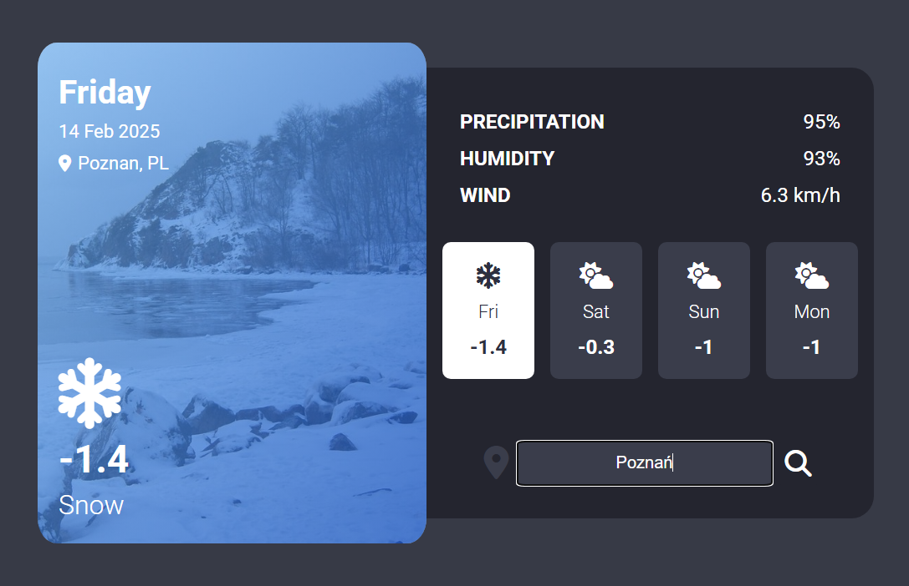

# Weather App

A simple weather application that displays current and forecasted weather conditions for a selected city.

## Features
- Fetch and display current weather for a selected location
- 3-day weather forecast
- Information about temperature, humidity, wind speed, and precipitation
- User-friendly interface
- City search functionality

## Technologies
- **Frontend:** HTML, CSS, JavaScript
- **Weather API:**
  - https://open-meteo.com/en/docs/geocoding-api
  - https://open-meteo.com/en/docs

